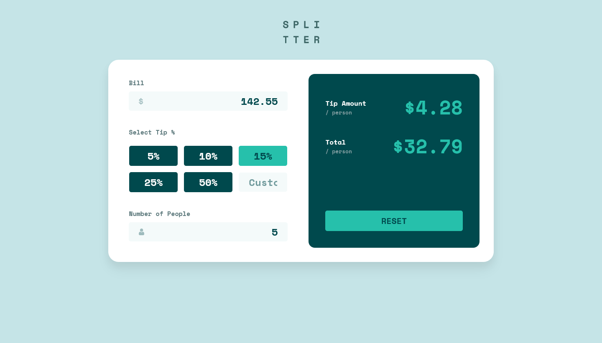
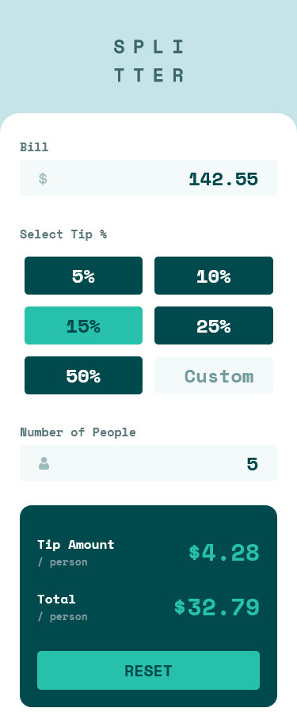

# Frontend Mentor - Tip calculator app solution

This is a solution to the [Tip calculator app challenge on Frontend Mentor](https://www.frontendmentor.io/challenges/tip-calculator-app-ugJNGbJUX). Frontend Mentor challenges help you improve your coding skills by building realistic projects.

## Table of contents

- [Overview](#overview)
  - [The challenge](#the-challenge)
  - [Screenshot](#screenshot)
- [My process](#my-process)
  - [Built with](#built-with)
- [Author](#author)

## Overview

### The challenge

Users should be able to:

- View the optimal layout for the app depending on their device's screen size
- See hover states for all interactive elements on the page
- Calculate the correct tip and total cost of the bill per person

### Links

- Solution URL: [GitHub](https://github.com/sergii-moroz/tip-calculator-app)

## My process

[YouTube](https://youtu.be/Bz_3odLrekg)

### Built with

- HTML5
- SASS

## Author

- Website - [YouTube](https://youtu.be/Bz_3odLrekg)
- Frontend Mentor - [link](https://www.frontendmentor.io/profile/sergii-moroz)

### Screenshot

